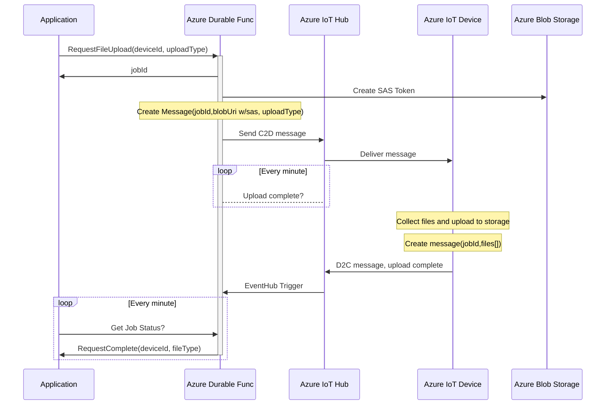

#  Scenario

This examples includes the following functionality.

- Cloud request to a device to upload a specific file
- Cloud request to a device to upload a collection of files to a Azure Blob Storage Container
- Device file synchronization from a device using the Azure IoT Edge Blob Storage Module
- Device file upload authorization using certificates

# Technologies / Services

- Azure IoT Hub
- Azure IoT Hub Service SDK
- Azure IoT Edge
- Azure IoT Hub Device SDK
- Azure IoT Edge Modules

# Scenario 1, Cloud initiated file upload request

# Scenario 2

