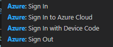

# How does IoT Hub compare to a MQTT broker?
Updated: June 9th 2022  

IoT Hub supports a subset of the MQTT v3.1.1 spec. IoT Hub is not a full-featured MQTT broker and does not support all the behaviors specified in the MQTT v3.1.1 standard. Read more at the following link.

[https://docs.microsoft.com/en-us/azure/iot-hub/iot-hub-mqtt-support](https://docs.microsoft.com/en-us/azure/iot-hub/iot-hub-mqtt-support)  

# What are the features of Azure Device Update (ADU)?
Updated: June 9th 2022
- Provides storage, management, and delivery to IoT devices
- Is integrated with IoT Hub and also includes a content delivery network
- Works based on a manifest that declares the desired state and update resources 
- Supports image (SWUpdate), package based (apt), and custom update types
- Updates can be cached at the Edge
- Supports updating components of a device such as attached sensors

A presentation that includes more info and links: [/resources/20220214_azure_device_update.pdf](/resources/20220214_azure_device_update.pdf)  

See the following presentation for more details.  
[https://github.com/Azure/iot-hub-device-update/tree/main/docs/agent-reference](https://github.com/Azure/iot-hub-device-update/tree/main/docs/agent-reference)  

Some additional reference links  
- [https://github.com/Azure/iot-hub-device-update/blob/main/docs/agent-reference/whats-new.md](https://github.com/Azure/iot-hub-device-update/blob/main/docs/agent-reference/whats-new.md)  
- [https://github.com/Azure/iot-hub-device-update/blob/main/docs/agent-reference/how-to-build-agent-code.md](https://github.com/Azure/iot-hub-device-update/blob/main/docs/agent-reference/how-to-build-agent-code.md)  
- [https://docs.microsoft.com/en-us/azure/iot-hub-device-update/understand-device-update](https://docs.microsoft.com/en-us/azure/iot-hub-device-update/understand-device-update)  

# What's a good starting point to understand resource organization in Azure than can account for resource, and network, separation for compliance or multi-tenancy needs?
Updated: June 9th 2022  

The Cloud Adoption Framework (CAF) is a good starting point as well as the Hub and Spoke architecture reference architecture.

Hub and Spoke  
[https://docs.microsoft.com/en-us/azure/architecture/reference-architectures/hybrid-networking/hub-spoke?tabs=cli](https://docs.microsoft.com/en-us/azure/architecture/reference-architectures/hybrid-networking/hub-spoke?tabs=cli)

CAF  
[https://docs.microsoft.com/en-us/azure/cloud-adoption-framework/](https://docs.microsoft.com/en-us/azure/cloud-adoption-framework/)  

# How can a device connect to IoT Hub without using the Azure IoT Device SDK?  
Updated: June 9th 2022  

The device may use MQTT clients rather than the Azure IoT SDK by following the instructions for authentication found in the following article.

[https://docs.microsoft.com/en-us/azure/iot-hub/iot-hub-mqtt-support#using-the-mqtt-protocol-directly-as-a-device](https://docs.microsoft.com/en-us/azure/iot-hub/iot-hub-mqtt-support#using-the-mqtt-protocol-directly-as-a-device)

The same article provides guidance for connecting Azure IoT Edge Modules directly as well, see the following section.  

[https://docs.microsoft.com/en-us/azure/iot-hub/iot-hub-mqtt-support#using-the-mqtt-protocol-directly-as-a-device](https://docs.microsoft.com/en-us/azure/iot-hub/iot-hub-mqtt-support#using-the-mqtt-protocol-directly-as-a-device)

# How can mender be used to provision and update devices?  
Updated: June 9th 2022  

The following articles discusses, with video, the capabilities of mender.  

[https://techcommunity.microsoft.com/t5/internet-of-things-blog/automatic-device-provisioning-with-azure-iot-hub-using-mender-io/ba-p/3113698](https://techcommunity.microsoft.com/t5/internet-of-things-blog/automatic-device-provisioning-with-azure-iot-hub-using-mender-io/ba-p/3113698)  

The follow reference from mender further details how the integration with IoT Hub works.  

[https://mender.io/partners/device-update-azure](https://mender.io/partners/device-update-azure)  

# Azure IoT Hub Jobs

Links
<hr/>  

[https://docs.microsoft.com/en-us/azure/iot-hub/iot-hub-devguide-jobs](https://docs.microsoft.com/en-us/azure/iot-hub/iot-hub-devguide-jobs)  


## Can jobs be created for devices while they're offline?

Yes, jobs can be submitted for devices while they're offline.  

## If jobs are submitted for multiple devices can detailed status be retrieved for each device?  

## What is the max timeout for a job?
Updated: June 30th 2022  

The maxExecutionTimeInSeconds setting controls the max run time. The max value that can be provided is 172,800, which equates to 48 hours.  
Any device that fails to update within this timeout will be marked to a failed state.  

# Azure Blob Storage IoT Edge Module

Links  
<hr/>  

https://docs.microsoft.com/en-us/azure/iot-edge/how-to-deploy-blob?view=iotedge-2020-11  
https://docs.microsoft.com/en-us/shows/internet-of-things-show/azure-blob-storage-on-azure-iot-edge  

## What settings exist for the Azure Blob Storage module?

The following link shows the supported configurations.  
https://docs.microsoft.com/en-us/azure/iot-edge/how-to-store-data-blob?view=iotedge-2020-11#devicetocloudupload-and-deviceautodelete-properties  

## Where does the Azure Blob Storage module store it's data?
Updated: July 14th 2022  

As all IoT Edge modules, it's a running container instance, that uses bind mounts for blob storage on the host Edge device.  You can read more about volume mounts at the link below.

Links  
<hr/>  

Bind Mounts: https://docs.docker.com/storage/bind-mounts/  
Storage, Binds: https://docs.microsoft.com/en-us/azure/iot-edge/how-to-access-host-storage-from-module?view=iotedge-2020-11

## Does a tutorial exist for the Blob Storage module?
Updated: July 14th 2022  

Yes, see the following link.  
https://docs.microsoft.com/en-us/azure/iot-edge/how-to-deploy-blob?view=iotedge-2020-11  

## Can a device isolated from the internet connect to the Blob Storage module?
Updated: July 14th 2022  

Yes, as shown in the following link your device can connect a variety of ways:  
- http://\<device IP\>:11002/\<account name\>
- http://\<IoT Edge device hostname\>:11002/\<account name\>
- http://\<fully qualified domain name\>:11002/\<account name\>  

The link also describes how accounts are used.  
https://docs.microsoft.com/en-us/azure/iot-edge/how-to-deploy-blob?view=iotedge-2020-11#configure-proxy-support  

## Can a device upload a blob directly to Azure Blob Storage?
Updated: July 14th 2022  

It should be possible, though thought not possible using the IoT Edge API Proxy module. It operates as a reverse proxy, rather than a forward proxy.  A reverse proxy acts as a man in the middle establishing TLS connections client->proxy and proxy->server. This breaks PKI based authentication schemes. The Azure IoT Edge API proxy module utilizes an Nginx reverse proxy, thus it thought it can't be used, more can be read here: https://docs.microsoft.com/en-us/dotnet/azure/sdk/azure-sdk-configure-proxy.  
The Azure Blob Storage module works by synchronizing blobs to the cloud, it does not allow direct connection.  

An example of a container that acts as a forward proxy.  
https://hub.docker.com/r/soulteary/docker-nginx-forward-proxy  

When using a forward proxy the client must be configured to use the forward proxy. You can see this in browser proxy configurations and in production documentation. Each implementation will require a different configuration for how forward proxy servers are set.  
The following links shows how the Azure SDK, used for Blob storage, can be configured with a forward proxy server.  
https://docs.microsoft.com/en-us/dotnet/azure/sdk/azure-sdk-configure-proxy?tabs=cmd  


# Azure IoT Hub Device Connection/Disconnection events/alerts

## Approach 1, use Diagnostic Settings and Alert Rules
Updated: July 14th 2022  

For simple needs, or small deployments, this approach may suffice. For advanced customization and integration to business line apps Approach 2 would be better suited.

1. Create a new diagnostic setting and set it to log to an existing Log Analytics workspace  
 


2. An example query to retrieve the data

```kql
AzureDiagnostics 
| project TimeGenerated, OperationName, ResultDescription, parse_json(properties_s).deviceId, parse_json(properties_s).protocol
```


3. Optionally, create an alert rule to notify you of connection status  

Links  
<hr/>  

https://docs.microsoft.com/en-us/azure/iot-hub/tutorial-use-metrics-and-diags  
https://docs.microsoft.com/en-us/azure/iot-hub/monitor-iot-hub  


## Approach 2, use Logic Apps and Azure IoT Hub Event subscriptions
Updated: July 14th 2022  

As shown in the 1st reference link this approach uses IoT Hub Event Subscriptions and Logic Apps to send emails.  


Links  
<hr/>  

https://docs.microsoft.com/en-us/azure/event-grid/publish-iot-hub-events-to-logic-apps  

Another similar approach  
https://docs.microsoft.com/en-us/azure/iot-hub/iot-hub-how-to-order-connection-state-events

# Azure API Management

## How can I log requests for Azure API Management?

1. If Azure Application Insights is a possibility then you can use built in Azure API Management functionality at API level. As shown at the following link you can see how to configured APIM within the Azure portal.  
https://docs.microsoft.com/en-us/azure/api-management/api-management-howto-app-insights  

2. If logging to another service a custom policy could be used to send the data using HTTP requests using the SendOneWayRequest Policy as shown at the following link.  
https://docs.microsoft.com/en-us/azure/api-management/api-management-advanced-policies#SendOneWayRequest  


3. If saving the logs as part of your regular application flow, and you expect high traffic volumes, then consider using Event Hub integration as shown at the following link. You could also chain from Event Hub to other 3rd party systems or integrations.  
https://docs.microsoft.com/en-us/azure/api-management/api-management-log-to-eventhub-sample  

## I'm receiving a 401 when trying use the Azure API Management VS Code extension to do something such as debug policies, what should I do?

Use the Azure Account extension to sign in again, you may have to sign out first.  Do this in the command pallette ctrl+shift+P. See below.  

  


